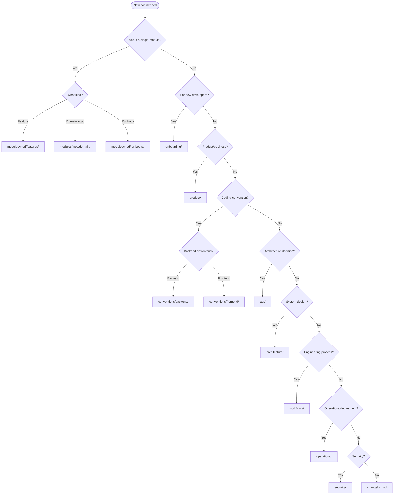

# Documentation Decision Guide

Use this guide when you're unsure where a document belongs. Ask the questions in order — the first match wins.

## Step 1: Is This Module-Specific?

> Does the doc describe a feature, domain rule, or operational concern that belongs to **one specific module**?

- **Yes** → Place it under `modules/<module-name>/` (see Module Subtree below)
- **No** → Continue to Step 2

> **Note:** The `modules/` directory only applies to monorepo or modular projects. See `references/project-types/monorepo.md`.

## Step 2: Match by Purpose

Ask yourself these questions. The first "yes" determines the location.

| # | Question | Location | Template |
|---|----------|----------|----------|
| 1 | Is this for a new developer joining the project? | `onboarding/` | Onboarding Guide |
| 2 | Is this a product requirement, PRD, or business glossary? | `product/` | Product/PRD |
| 3 | Is this about coding conventions, patterns, or standards? | `conventions/backend/` or `conventions/frontend/` | None (reference doc) |
| 4 | Is this an architecture decision with trade-offs? | `adr/` | ADR |
| 5 | Is this about system design, data model, or infrastructure? | `architecture/` | None |
| 6 | Is this a step-by-step engineering process? | `workflows/` | Workflow |
| 7 | Is this about deployment, monitoring, incidents, or releases? | `operations/` | Runbook or Postmortem |
| 8 | Is this about security posture, secrets, or threat modeling? | `security/` | None or Runbook |
| 9 | Is this a post-incident report? | `operations/` | Postmortem |
| 10 | Is this a notable release change? | `changelog.md` | N/A (append entry) |

## Module Subtree (for modular projects)

When the doc is module-specific:

| Sub-type | Location | Template |
|----------|----------|----------|
| Feature implementation | `modules/<m>/features/` | Feature |
| Domain / business logic | `modules/<m>/domain/` | Feature |
| Module-specific runbook | `modules/<m>/runbooks/` | Runbook |

## Visual Flowchart

## Common Boundary Cases

- **"API validation patterns"** → `conventions/backend/` (it's a coding standard, not a feature)
- **"How auth works in module X"** → `modules/x/features/` (module-specific feature)
- **"Cross-cutting auth architecture"** → `architecture/` or `security/` (spans modules)
- **"Deploy to staging"** → `operations/` (operational procedure)
- **"Git branching strategy"** → `workflows/` (engineering process)
- **"Why we chose PostgreSQL"** → `adr/` (architecture decision)
- **"Incident: DB outage on 2024-01-15"** → `operations/` with Postmortem template
